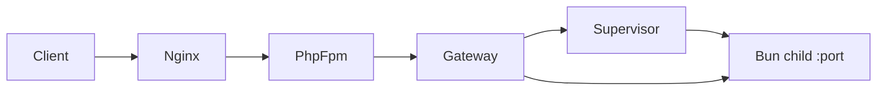

# JitPit Router

**PHit Router** — a PHP 8 gateway experiment for when you need to haul a *dumptruck of containers* through local dev without melting RAM or manually flipping every microservice between “production build” and “watch mode” because your laptop said no.

> <!-- experimental inspiration, not a benchmark claim -->
> *In an alternate timeline, PHP 8.5 JIT + opcache preloading makes this gateway “fast enough that your staff engineer stops suggesting we rewrite it in Go.” We are not in that timeline. We are in the timeline where the gateway’s job is to **not** run sixty Nest services at once.*

The codebase still lives under the `JitRouter\` namespace—portfolio name above, implementation name unchanged.

## The problem

Local microservice sprawl is a memory problem dressed up as an architecture diagram. You register `frontend`, `users`, `payments`, and twelve services whose names are just other services with `-gateway` appended. Docker Desktop fans spin. Every repo wants `build` + `start` + `dev` running “just in case.” You touch one app; the rest stay in heavy build mode because switching modes across repos is its own unpaid internship.

## The solution (today)

One PHP entry (`public/index.php`) behind nginx or `php -S`. Routes `/api/services/{name}/…` to `127.0.0.1:{port}`. On each request the supervisor **fingerprints** watched sources (respecting `.gitignore`), then **build → start → ready → proxy** only when something changed. Idle services stay down. If a rebuild fails, **last-good stays up** (`degraded` runtime state and `X-Dev-Stale: 1` on responses).

**North star (not fully wired yet):** when watched sources change *and* the service repo’s git tree is “dev-dirty” (e.g. HEAD one step ahead of a clean baseline), prefer a **dev runtime** for that service only—lighter RAM, faster iteration—while siblings stay on build/start until a request wakes them. **Phase 2 proves the gateway path; HEAD-aware dev mode is the direction, not a shipped toggle.**

## When this is a fit

- A handful of Bun/Node (argv) children, local/dev only
- One URL in front of many small services
- Fingerprint-driven rebuilds instead of always-on processes
- Private env vars projected from the host without leaking them upstream

A tool for unusual setups—not something you adopt by default.

## When not to use this

If the company already has sixty Nest.js microservices—each with a Dockerfile, a Helm chart, and a Slack channel named `#user-service-for-the-user-service`—this will not fix the org chart. You already made that choice.

Also: not production, not Windows, not systemd/k8s/pm2, and not real `@nestjs/cli` (Phase 2 fixtures are Bun mocks that *look* like Nest monorepos).

**Experimental PHP; do not ship this.**

## Quick start

**Docker (recommended)**

```bash
docker compose -f docker/compose.yml up -d --build
curl -sS http://127.0.0.1:8080/api/services/api-simple/health
curl -sS http://127.0.0.1:8080/__dev/services
```

**Host fallback**

```bash
JIT_STATE_DIR=.jit-state php -S 127.0.0.1:8090 -t public
```

**Checks**

```bash
./bin/dev check   # lint + test + smoke
```

See [`bin/dev`](./bin/dev) for `format`, `lint`, `test`, and `smoke`.

## Config

Real services live in [`config/services.php`](config/services.php). The repo ships Phase 2 **fixtures** (`api-simple`, `api-with-lib`, etc.); below is an **illustrative** registry—fake names, plausible shape—for how you might register a small fleet locally:

```php
// README example only — not copied into config/services.php
'frontend' => [
    'dir' => 'services/frontend',
    'port' => 4200,
    'commands' => [
        'build' => ['bun', 'run', 'build'],
        'start' => ['bun', 'run', 'start'],
    ],
    'watch' => ['services/frontend/apps/web', 'services/frontend/packages/ui-kit'],
    'envPublic' => ['PORT' => '4200', 'NODE_ENV' => 'development'],
    'envPrivate' => [],
    'readyPath' => '/health',
],
'kafka' => [
    'dir' => 'infra/kafka-proxy',
    'port' => 9092,
    'commands' => [
        'build' => ['bun', 'run', 'build'],
        'start' => ['bun', 'run', 'start'], // supervised child, not a full MS fantasy
    ],
    'watch' => ['infra/kafka-proxy/src'],
    'envPublic' => ['PORT' => '9092', 'KAFKA_BROKER' => '127.0.0.1:9092'],
    'envPrivate' => [],
    'readyPath' => '/ready',
],
'redis' => [
    'dir' => 'services/redis-sidecar-mock',
    'port' => 6379,
    'commands' => [
        'build' => ['bun', 'run', 'build'],
        'start' => ['bun', 'run', 'start'], // cache sidecar mock, not Redis itself
    ],
    'watch' => ['services/redis-sidecar-mock'],
    'envPublic' => ['PORT' => '6379'],
    'envPrivate' => [],
    'readyPath' => '/ping',
],
'users' => [
    'dir' => 'services/users',
    'port' => 4101,
    'commands' => [
        'build' => ['bun', 'run', 'build'],
        'start' => ['bun', 'run', 'start'],
    ],
    'watch' => ['services/users/apps/users-api', 'services/users/packages/auth'],
    'envPublic' => ['PORT' => '4101'],
    'envPrivate' => [
        'DATABASE_URL' => 'JIT_USERS_DATABASE_URL',
    ],
    'readyPath' => '/health',
],
'payments' => [
    'dir' => 'services/payments',
    'port' => 4102,
    'commands' => [
        'build' => ['bun', 'run', 'build'],
        'start' => ['bun', 'run', 'start'],
    ],
    'watch' => ['services/payments/apps/payments-api'],
    'envPublic' => ['PORT' => '4102'],
    'envPrivate' => [
        'STRIPE_SECRET' => 'JIT_STRIPE_SECRET',
    ],
    'readyPath' => '/health',
],
```

Do **not** paste a registry like this into production config:

```php
// illustrative only — please no
'user-service' => [ /* ... */ ],
'user-service-gateway' => [ /* ... */ ],
'user-service-gateway-bff' => [ /* ... */ ],
```

## Request path

1. Parse `/api/services/{name}/…` ([`RequestParser`](src/Http/RequestParser.php)).
2. `ensureReady()` — fingerprint watch paths, rebuild/start if needed, wait for `readyPath` or TCP.
3. Cold HTML `GET` may return **202** with an SSE boot page; API clients wait, then proxy.
4. Forward to the child on `127.0.0.1:{port}` ([`Gateway`](src/Http/Gateway.php)).



## Status

Personal after-hours experiment. Composer-free `JitRouter\` autoload under `src/`. PHP **8.4+** in Docker; **8.5-oriented** conventions—see [wiki/php-8.5/Best_Practices.md](wiki/php-8.5/Best_Practices.md). **Linux only.**

Release validation and known limitations: [`docs/RELEASE_REVIEW.md`](docs/RELEASE_REVIEW.md).

Portfolio prompt for agents: [`docs/JITPIT_PROMPT.md`](docs/JITPIT_PROMPT.md).

## License

[MIT](LICENSE)
